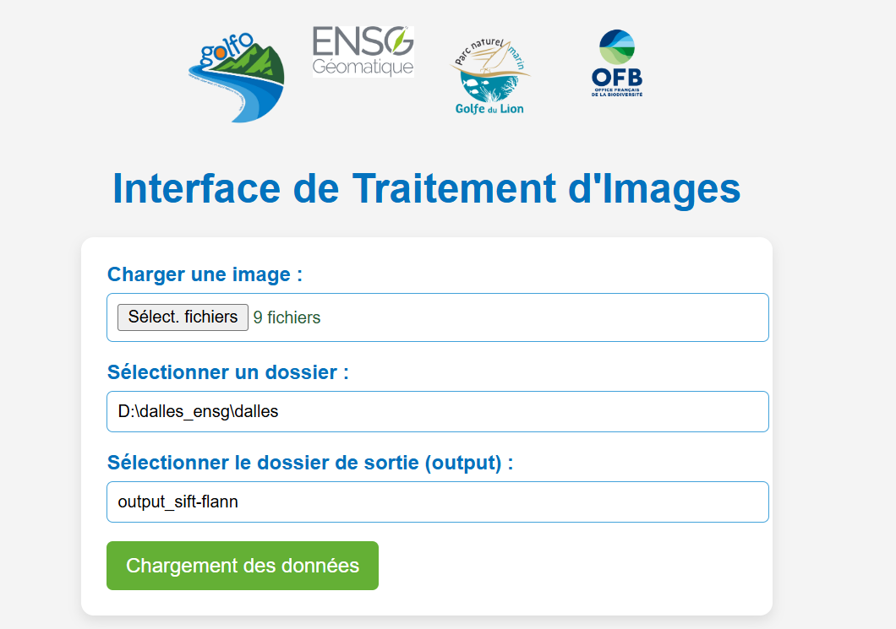
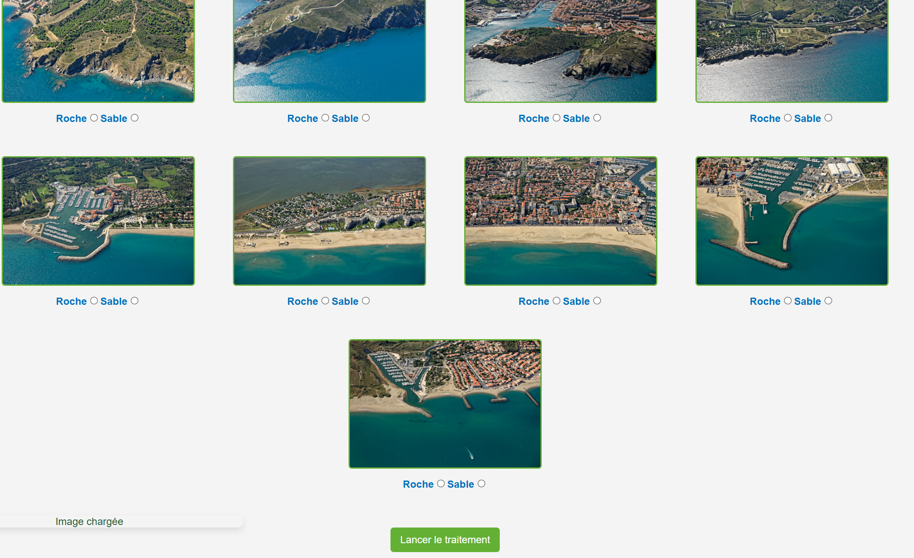

# Manuel d'utilisation - Installation et Lancement de l'Application GOLFO

### Prérequis
Avant de commencer, assurez-vous d'avoir les éléments suivants :
* Un environnement Python installé sur votre machine.
* Les dépendances nécessaires pour exécuter l'application (vérifiez la documentation ou le fichier requirements.yml si disponible).

### Étapes d'Installation
1.	**Téléchargez et extrayez** l'application sur votre ordinateur si cela n'est pas encore fait.
2.	**Ouvrez un terminal ou une invite de commande** dans le dossier contenant le fichier app.py.
3.	**Lancez** l'application en exécutant la commande suivante ou en double-cliquant dessus :
python app.py
4.	Une fois l'application démarrée, une invite de commande affichera un lien.
5.	**Accédez au site web** en suivant l'une des méthodes suivantes :
* **Méthode 1** : maintenez la touche Ctrl enfoncée et cliquez sur le lien affiché dans l'invite de commande.
* **Méthode 2** : copiez le lien et collez-le dans la barre d'adresse de votre navigateur web préféré.

### Configuration des données utilisateur

Avant de lancer le traitement, vous devez fournir trois informations essentielles :
1.	**Insérer des images** : les images doivent contenir des coordonnées dans leurs métadonnées. Ces coordonnées doivent être au format WGS84, qui est la norme attendue pour ce type d'appareil (*1).
2.	**Fournir le chemin vers le dossier des dalles** : nous garantissons le bon fonctionnement avec les dalles Pléiades fournies. Il est possible que certaines générations de dalles aient des versions différentes. Pour garantir un fonctionnement optimal, utilisez les dalles fournies.
* Si vous utilisez vos propres dalles, vérifiez que le chemin que vous fournissez n'est pas trop long et n'inclut pas de caractères d'échappement qui pourraient poser problème.
* En cas de doute, placez simplement vos dalles à la racine du logiciel et renommez le dossier dalles, en remplaçant les dalles par défaut par les vôtres (conservez une copie des dalles par défaut au cas où).
3.	**Fournir le chemin vers le dossier de sortie** : ce dossier doit être créé avant le lancement des traitements.

### Lancement du Traitement
Une fois ces étapes complétées, vous pouvez charger vos données. Si aucune erreur n'est détectée, vos images devraient apparaître. Si ce n'est pas le cas, vérifiez les coordonnées dans les métadonnées (*1).
Ensuite, pour chaque image, vous pouvez choisir entre deux options :
* **Roche** : l'algorithme roche est plus long à exécuter (environ 30 minutes par image).
* **Sable** : l'algorithme sable est plus rapide (environ 45 secondes par image). Utilisez ces options en fonction de vos besoins et du temps disponible.

### Résultats en Sortie
À la fin du traitement, plusieurs dossiers seront générés dans le dossier de sortie, chacun correspondant à une image traitée. Chaque dossier contient :
* **crop.png** : portion de dalle Pléiades correspondant à l'image traitée.
* **transformed_image.png** : superposition entre la photo oblique et l'image aérienne.
* **trait_de_cote.png** : image avec le trait de côte identifié en rouge par l'algorithme.
* **keypoints.txt** : fichier contenant les points d'intérêt entre les deux images (utilisable pour d'autres méthodes d'exploration).
* **Dossier shapefile** : contient un fichier shapefile directement utilisable dans le SIG de votre choix.

### Outil de Vérification de la Qualité
Un outil tools.py est disponible pour vérifier la qualité de vos superpositions.
* Si la qualité est suffisante, cliquez sur **Save**.
* Si la qualité n'est pas satisfaisante, cliquez sur **Pass**.
Assurez-vous d'avoir préalablement défini le chemin de sortie de l'application web. Un nouveau dossier de sortie contenant les images filtrées sera alors généré.
Bonne navigation et bon traitement de vos images !

### Partie Edition d'image
Cet outil est disponible dans la barre header en haut de l'application sous le bouton "Editeur d'images".

